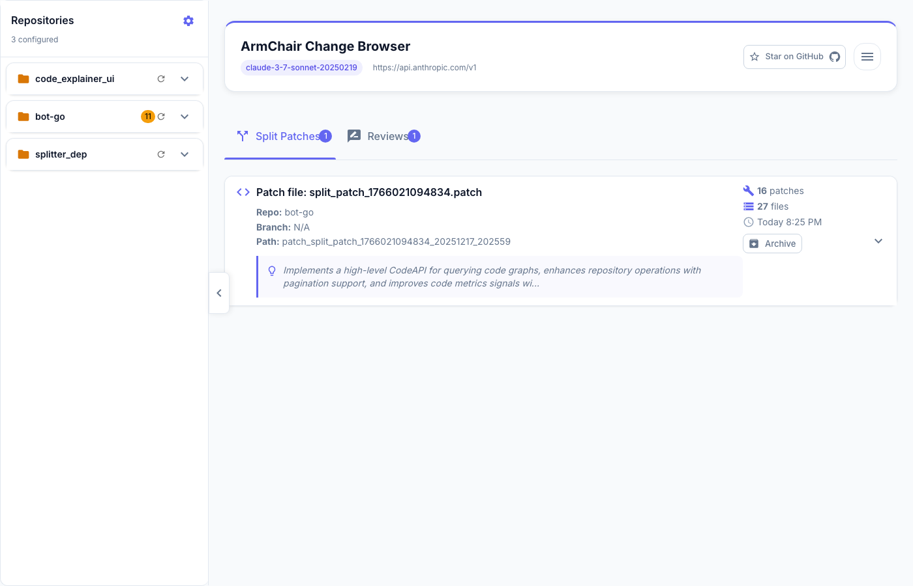
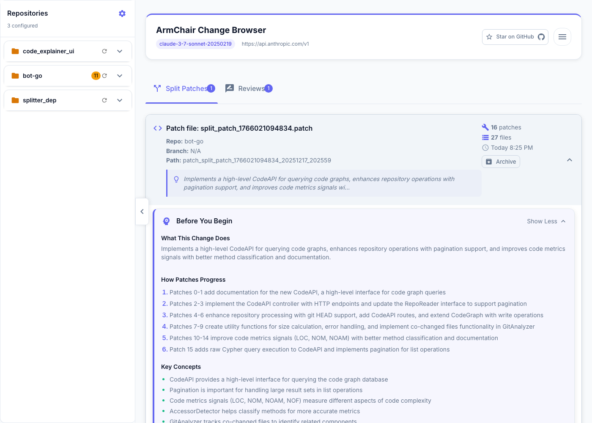

# Armchair

[](https://hub.docker.com/r/armchr/explainer)
[](#license)

**AI-powered code analysis that helps developers understand and review changes faster.**

Armchair bridges the gap between AI-assisted coding and real developer productivity by breaking down commits into logical chunks and providing intelligent code reviews—all through an interactive dashboard.

---

## Table of Contents

- [Quick Start](#quick-start)
- [Features](#features)
- [LLM Setup](#llm-setup)
- [Performance Tips](#performance-tips)
- [Configuration](#configuration)
- [CLI Usage](#cli-usage)
- [API Reference](#api-reference)
- [Security Model](#security-model)
- [Troubleshooting](#troubleshooting)
- [Contributing](#contributing)
- [License](#license)
- [Changelog](#changelog)
- [Advanced: Manual Docker](#advanced-manual-docker)
- [Development](#development)

---

## Quick Start

Get Armchair running in under 2 minutes.

### Prerequisites

- **[Docker Desktop](https://www.docker.com/products/docker-desktop/)** (version 20.10+) installed and running
- An LLM provider configured — see [LLM Setup](#llm-setup) for options

### Install & Run

```bash
curl -fsSL https://raw.githubusercontent.com/armchr/armchr/main/scripts/armchair.sh -o armchair.sh
chmod +x armchair.sh
./armchair.sh
```

The script will:
1. Prompt for your code repositories root directory
2. Pull the latest Docker image
3. Start the dashboard at **http://localhost:8686**
4. Open your browser automatically for further setup

### First-Time Setup



1. Click the **Settings** icon (⚙️) in the dashboard
2. Configure your LLM:
   | Provider | API Base URL | Model |
   |----------|--------------|-------|
   | Claude | `https://api.anthropic.com/v1` | `claude-sonnet-4-20250514` |
   | OpenAI | `https://api.openai.com/v1` | `gpt-4o` |
   | Ollama | `http://host.docker.internal:11434/v1` | `qwen3:32b` |

   See [LLM Setup](#llm-setup) for detailed instructions on getting API keys or installing local models.
3. Add your repositories (paths must be under your workspace directory)
4. Start analyzing commits

---

## Features

### Splitter Agent
Breaks down commits into logical, reviewable chunks:
- Identifies code structures and relationships
- Generates structured output for downstream analysis
- Supports multiple programming languages (Python, Go, JS/TS, Java, Rust, C/C++)

> **Standalone usage:** The Splitter Agent can be used independently via CLI. See the [Code Splitter Agent README](code-splitter-agent/README.md#quick-start) for details.

#### Mental Model: Understand Before You Review

When you split a large change, Armchair generates a **mental model** to help reviewers understand the big picture before diving into code:



The mental model includes:
- **What This Change Does**: High-level summary of the entire changeset
- **How Patches Progress**: Step-by-step guide through the logical order of patches
- **Key Concepts**: Important domain concepts and patterns introduced
- **Review Tips**: Suggestions for what to focus on during review

#### Patch Splits: Large Changes Made Reviewable

A single large commit gets split into multiple smaller, logically-grouped patches:


Each patch shows:
- Descriptive title explaining what it does
- Files affected with annotation counts
- Lines changed summary

### Dashboard
Interactive web UI at http://localhost:8686:
- Browse branches, commits, and uncommitted changes
- Run splitter and reviewer analysis
- Visualize annotated code explanations

#### Change Annotations: AI-Explained Code Changes

Each code change in a split patch includes AI-generated annotations that explain what the change does:


The annotated diff viewer shows:
- **Inline annotations**: AI explanations embedded directly in the diff
- **Side-by-side diff**: Before and after comparison
- **Line-level context**: Annotations reference specific line ranges

### Reviewer Agent
AI-powered code review:
- Analyzes commits and uncommitted changes
- Provides feedback on code quality and best practices
- Generates detailed suggestions

**Backend API** available at http://localhost:8787 for programmatic access.

---

## LLM Setup

Armchair requires an LLM to power its analysis. You can use proprietary cloud APIs or run open models locally.

### Proprietary LLMs (Cloud APIs)

#### Anthropic (Claude)

Claude models excel at code understanding and review tasks.

| Setting | Value |
|---------|-------|
| **API Base URL** | `https://api.anthropic.com/v1` |
| **Recommended Model** | `claude-sonnet-4-20250514` |

**Get an API key:**
1. Create an account at [console.anthropic.com](https://console.anthropic.com/)
2. Navigate to [API Keys](https://console.anthropic.com/settings/keys)
3. Click "Create Key" and copy it to your Armchair settings

#### OpenAI

| Setting | Value |
|---------|-------|
| **API Base URL** | `https://api.openai.com/v1` |
| **Recommended Model** | `gpt-4o` |

**Get an API key:**
1. Create an account at [platform.openai.com](https://platform.openai.com/)
2. Navigate to [API Keys](https://platform.openai.com/api-keys)
3. Click "Create new secret key" and copy it to your Armchair settings

### Local LLMs with Ollama

Run models locally for privacy and no API costs. [Ollama](https://ollama.com/) makes it easy to run open-source models.

#### Install Ollama

1. Download from [ollama.com/download](https://ollama.com/download)
2. Install and start Ollama
3. Verify installation: `ollama --version`

#### Install a Coding Model

We recommend **Qwen3 Coder** for code analysis:

```bash
# Install Qwen3 Coder (recommended for code tasks)
ollama pull qwen3:32b

# Or for smaller systems
ollama pull qwen3:14b
```

#### Other Recommended Models

| Model | Command | Best For |
|-------|---------|----------|
| **Qwen3** | `ollama pull qwen3:32b` | Code analysis, general reasoning |
| **DeepSeek Coder V2** | `ollama pull deepseek-coder-v2:16b` | Code-specific tasks |
| **DeepSeek R1** | `ollama pull deepseek-r1:32b` | Complex reasoning, detailed analysis |
| **Llama 3.1** | `ollama pull llama3.1:70b` | General purpose, well-rounded |
| **Llama 3.1 (smaller)** | `ollama pull llama3.1:8b` | Faster, lower resource usage |

#### Configure Armchair for Ollama

In the Armchair Settings UI:

| Setting | Value |
|---------|-------|
| **API Base URL** | `http://host.docker.internal:11434/v1` |
| **Model Name** | `qwen3:32b` (or your installed model) |
| **API Key** | Leave empty |

**Important:** Use `host.docker.internal` instead of `localhost` so the Docker container can reach your local Ollama instance.

---

## Performance Tips

For large repositories, enable `commitOnly` mode to skip loading unstaged/untracked files:

**Via Settings UI:** Toggle "Commit Only" when adding a repository

**Via config file** (`~/.armchair_output/.armchair/source.yaml`):
```yaml
source:
  repositories:
    - name: "large-repo"
      path: "/path/to/large-repo"
      commitOnly: true  # Faster loading, commits still available
```

When enabled:
- All commits and branches remain available
- Dashboard loads significantly faster
- Unstaged/untracked files are hidden

---

## Configuration

All settings are managed through the dashboard Settings UI (⚙️) or config files.

### Config Files

| File | Purpose |
|------|---------|
| `~/.armchair_output/.armchair/.armchair.json` | LLM settings (API URL, model, key) |
| `~/.armchair_output/.armchair/source.yaml` | Repository configuration |

### Output Structure
```
~/.armchair_output/
├── .armchair/
│   ├── source.yaml         # Repository config
│   └── .armchair.json      # LLM settings
├── commit_*/               # Split patches
└── reviews/                # Code reviews
```

### Script Options

```bash
./armchair.sh [OPTIONS]

Options:
  --port-frontend PORT    Frontend port (default: 8686)
  --port-backend PORT     Backend port (default: 8787)
  --foreground, -f        Run in foreground (show logs)
  --name NAME             Container name (default: armchair-dashboard)
  --local                 Use local image 'explainer:latest'
  --image IMAGE           Use custom Docker image
  --help, -h              Show help
```

---

## CLI Usage

Run the Splitter Agent standalone (without the dashboard) for CI/CD or automation:

```bash
./scripts/run_splitter.sh --repo REPO_NAME --api-key YOUR_API_KEY
```

### Options

| Flag | Description |
|------|-------------|
| `--repo NAME` | Repository name from config (required) |
| `--api-key KEY` | API key (or set `OPENAI_API_KEY` env var) |
| `--commit HASH` | Analyze specific commit |
| `--patch` | Analyze uncommitted changes |
| `--mcp-config FILE` | [MCP](https://modelcontextprotocol.io/) server configuration file |
| `--verbose` | Enable verbose output |
| `--interactive, -it` | Interactive mode |

**Note:** The `--mcp-config` flag enables integration with Model Context Protocol servers, allowing the splitter to use additional tools and context sources during analysis.

---

## API Reference

### Trigger Analysis

```bash
# Split a specific commit
curl -X POST http://localhost:8787/api/split \
  -H "Content-Type: application/json" \
  -d '{"repoName": "my-repo", "branch": "main", "commitId": "abc1234"}'

# Split uncommitted changes
curl -X POST http://localhost:8787/api/split \
  -H "Content-Type: application/json" \
  -d '{"repoName": "my-repo", "branch": "main"}'
```

### Other Endpoints

```bash
# List repositories and branches
curl http://localhost:8787/api/repositories

# List analyzed commits
curl http://localhost:8787/api/commits

# Get commit diff
curl http://localhost:8787/api/repositories/my-repo/commits/abc1234/diff

# Get uncommitted changes
curl http://localhost:8787/api/repositories/my-repo/branches/main/working-directory/diff
```

---

## Security Model

Armchair is designed with security in mind:

| Aspect | Implementation |
|--------|----------------|
| **File Access** | Your home directory is mounted **read-only** (`-v "$HOME:/workspace:ro"`) |
| **Data Locality** | All processing happens locally—no data sent to Armchair servers |
| **LLM Communication** | Only files you explicitly select are sent to your configured LLM |
| **Output Isolation** | Results stored in `~/.armchair_output`, separate from your code |

**What gets sent to the LLM:**
- Code diffs you choose to analyze
- File contents within those diffs

**What stays local:**
- Repository metadata
- Git history
- All files not explicitly analyzed

---

## Troubleshooting

### Docker Issues

| Problem | Solution |
|---------|----------|
| Container won't start | Verify Docker is running: `docker info` |
| Port in use | Use `--port-frontend 3000 --port-backend 3001` |
| Permission denied | Add workspace to Docker Desktop → Settings → Resources → File Sharing |

```bash
# View logs
docker logs armchair-dashboard

# Follow logs
docker logs -f armchair-dashboard

# Clean restart
docker stop armchair-dashboard && docker rm armchair-dashboard
./armchair.sh
```

### LLM Issues

| Problem | Solution |
|---------|----------|
| API errors | Verify API key is valid |
| Model not found | Check model name matches provider exactly |
| Ollama not connecting | Use `http://host.docker.internal:11434/v1` (not localhost) |

### Configuration Issues

| Problem | Solution |
|---------|----------|
| Repository not showing | Add via Settings UI (⚙️) |
| Can't access repo | Ensure path is under your workspace directory |

---

## Contributing

We welcome contributions! Please:

1. Open an issue to discuss proposed changes
2. Fork the repository
3. Create a feature branch
4. Submit a pull request

Report bugs and request features via [GitHub Issues](https://github.com/armchr/armchr/issues).

---

## License

MIT License. See [LICENSE](LICENSE) for details.

---

## Changelog

See [CHANGELOG.md](CHANGELOG.md) and [Releases](https://github.com/armchr/armchr/releases) for version history.

**Current Version:** v0.2

---

## Advanced: Manual Docker

For manual Docker control without the script:

```bash
docker run -d \
  --name armchair-dashboard \
  -p 8686:8686 -p 8787:8787 \
  -v "$HOME:/workspace:ro" \
  -v "$HOME/.armchair_output:/app/output" \
  --entrypoint /bin/bash \
  armchr/explainer:latest \
  -c "cd /app/backend && node server.js --output /app/output --root-map /workspace --root-dir $HOME & cd /app/frontend && serve -s dist -l 8686"
```

### Management Commands

```bash
docker logs armchair-dashboard      # View logs
docker logs -f armchair-dashboard   # Follow logs
docker stop armchair-dashboard      # Stop
docker start armchair-dashboard     # Start
docker rm armchair-dashboard        # Remove
```

---

## Development

### Building and Running Locally with Docker

Build the Docker image locally and run it using the same pattern as production:

```bash
# Build for local platform
make docker-build

# Build for multiple platforms (amd64 + arm64)
make docker-build-multi

# Run locally (defaults: ARMCHAIR_ROOT=$HOME, ARMCHAIR_OUTPUT=~/.armchair_output)
make docker-run

# Run with custom paths
make docker-run ARMCHAIR_ROOT=/Users/me/src ARMCHAIR_OUTPUT=/Users/me/.armchair_output
```

Run `make help` to see all available targets and current configuration.

### Component Documentation

For detailed documentation on individual components, see:

- **[code_explainer_ui README](code_explainer_ui/README.md)**: Full architecture documentation (React frontend, Express.js backend, AI agents), local development setup, environment variables, API endpoint reference, MCP server mode, and project structure
- **[Code Splitter Agent README](code-splitter-agent/README.md)**: Standalone splitter usage, pipeline architecture, and language support
