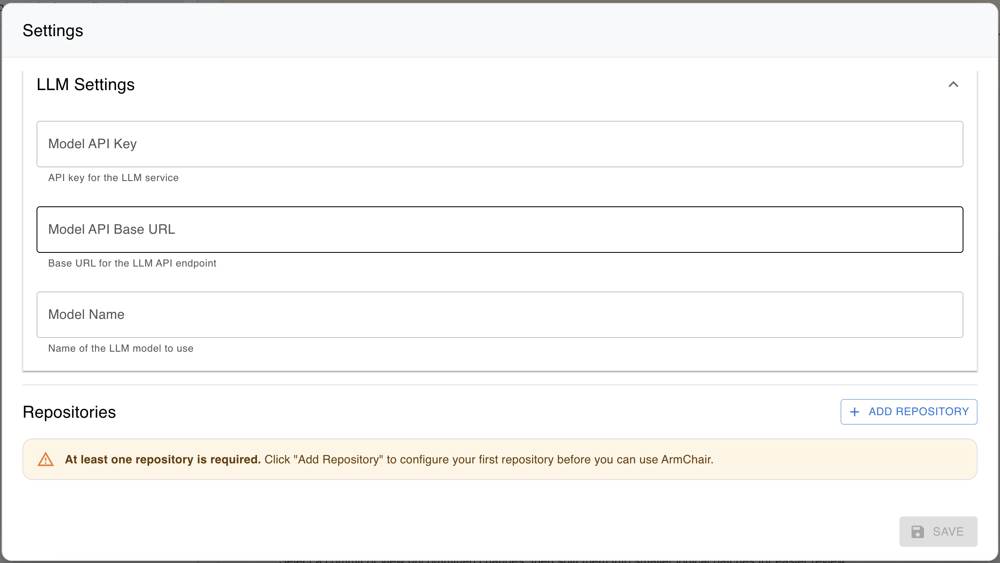

# Armchair

Armchair is a set of tools to improve developer velocity while using AI coding agents like Claude Code, Github Copilot, Cursor etc.

Currently we are releasing v0 of our first two tools.

## Tools

### 🔄 Splitter Agent
The **Splitter Agent** breaks down commits (or uncommitted changes) into logical chunks for easier analysis. It can:
- Identify code structures and relationships
- Generate structured output for downstream analysis
- Support multiple programming languages

### 🌐 Armchair Dashboard
The **Armchair Dashboard** provides simple access to all the ArmChair tools (only Splitter now):
- Visualizes code analysis results from the Splitter Agent
- Provides an interactive frontend for navigating code explanations
- Enables running splitter analysis directly from the UI
- Available at http://localhost:8686

## Quick Start

The easiest way to run Armchair is using the Docker image. Follow these steps to get started:

### Prerequisites

- Docker installed and running

### Run Armchair

Simply run the Armchair script:

```bash
./scripts/armchair.sh
```

The script will:
- Prompt you to choose a workspace location (your home directory or a custom path)
- Create a `.armchair_output` directory to store analysis results and temporary files
- Start the Armchair Dashboard in Docker
- Automatically open the dashboard in your browser at http://localhost:8686

**Privacy Notice:**
Docker Desktop may ask for permission to access your files. This is required because:
- Armchair needs to read repositories you explicitly configure in the UI
- Only specific code files you select are sent to your configured LLM
- No files are sent to Armchair servers - all processing is local

### Using the Dashboard

Once the dashboard opens in your browser (http://localhost:8686), you need to configure it:

#### 1. Configure LLM Settings
Click on the **Settings** icon (⚙️) in the dashboard to configure your AI model:



- **API Base URL:** The endpoint for your LLM service
  - Claude (Anthropic): `https://api.anthropic.com/v1`
  - OpenAI: `https://api.openai.com/v1`
  - Ollama (local): `http://host.docker.internal:11434/v1`

- **Model Name:** The specific model to use
  - Claude: `claude-3-5-sonnet-20241022`, `claude-3-5-haiku-20241022`
  - OpenAI: `gpt-4o`, `gpt-4o-mini`
  - Ollama: `qwen2.5-coder:32b`, `deepseek-coder-v2:16b`, `llama3.1:8b`

- **API Key:** Your API key (not required for Ollama)

**Note for Local LLM (Ollama):** Use `http://host.docker.internal:11434/v1` instead of `http://localhost:11434/v1` to allow the Docker container to access your local Ollama service.

#### 2. Configure Repositories
In the same Settings dialog, add repositories you want to analyze:
- Click "Add Repository"
- Enter repository name and path
- The path must be under your chosen workspace directory

#### 3. Start Using Armchair
After configuration:
- **Browse Code:** Navigate branches, commits, and uncommitted changes
- **Run Analysis:** Use the splitter agent to break down commits into logical chunks
- **Explore Results:** View the separate patches and annotated changes

**Backend API:** Available at http://localhost:8787 for programmatic access

**Performance Tip for Large Repositories:**

For very large repositories, the dashboard can be slow when loading unstaged/untracked files. You can improve performance by adding `commitOnly: true` to specific repositories in your configuration via the Settings UI or by editing `~/.armchair_output/.armchair/source.yaml`:

```yaml
source:
  repositories:
    - name: "large-repo"
      path: "/Users/yourname/projects/large-repo"
      commitOnly: true  # Skip unstaged/untracked files for better performance
    - name: "normal-repo"
      path: "/Users/yourname/projects/normal-repo"
      # commitOnly defaults to false
```

When `commitOnly: true` is set:
- All commits and branches remain available for exploration and analysis
- Unstaged and untracked files are not loaded in the dashboard
- Dashboard loads significantly faster for very large repositories
- You can still analyze specific commits via the UI or API


### Advanced Options

```bash
# Run in foreground mode (see logs in terminal)
./scripts/armchair.sh --foreground

# Use custom ports
./scripts/armchair.sh --port-frontend 3000 --port-backend 3001

# Use local Docker image (for development)
./scripts/armchair.sh --local

# Use custom Docker image
./scripts/armchair.sh --image my-custom-image:tag

# Show help
./scripts/armchair.sh --help
```

**Available Options:**
- `--port-frontend PORT` - Frontend UI port (default: 8686)
- `--port-backend PORT` - Backend API port (default: 8787)
- `--foreground, -f` - Run in foreground mode (shows logs in terminal)
- `--name NAME` - Custom container name (default: armchair-dashboard)
- `--local` - Use local image 'explainer:latest'
- `--image IMAGE` - Use custom Docker image
- `--help, -h` - Show full help message

### Management Commands

```bash
# View logs
docker logs armchair-dashboard

# Follow logs in real-time
docker logs -f armchair-dashboard

# Stop dashboard
docker stop armchair-dashboard

# Start stopped dashboard
docker start armchair-dashboard

# Remove container
docker rm armchair-dashboard
```

### 4. Trigger Analysis via API

Once the dashboard is running, you can trigger splitter analysis from the UI for any commit or uncommitted changes.
If you need direct access to the splitter agent programmatically, trigger it via the backend API:

```bash
# Split a specific commit
curl -X POST http://localhost:8787/api/split \
  -H "Content-Type: application/json" \
  -d '{
    "repoName": "my-repo",
    "branch": "main",
    "commitId": "abc1234"
  }'

# Split uncommitted changes (working directory)
curl -X POST http://localhost:8787/api/split \
  -H "Content-Type: application/json" \
  -d '{
    "repoName": "my-repo",
    "branch": "main"
  }'

```

**Parameters:**
- `repoName` (required) - Repository name from your source config
- `branch` (required) - Target branch to analyze
- `commitId` (optional) - Specific commit hash to analyze. If omitted, analyzes uncommitted changes

**Other useful API endpoints:**

```bash
# List all repositories and their branches
curl http://localhost:8787/api/repositories

# List all analyzed commits
curl http://localhost:8787/api/commits

# Get diff for a specific commit
curl http://localhost:8787/api/repositories/my-repo/commits/abc1234/diff

# Get uncommitted changes diff
curl http://localhost:8787/api/repositories/my-repo/branches/main/working-directory/diff
```

## Configuration

All configuration is done through the Settings UI in the dashboard (⚙️ icon).

### LLM Configuration
Configure your AI model settings:
- **API Base URL:** Endpoint for your LLM service
- **Model Name:** The specific model to use
- **API Key:** Your API key (if required)

Settings are stored in `~/.armchair_output/.armchair/.armchair.json`.

### Repository Configuration
Add repositories you want to analyze:
- Click "Add Repository" in the Settings dialog
- Provide repository name and full path
- Paths must be under your chosen workspace directory

Configuration is stored in `~/.armchair_output/.armchair/source.yaml`.

### Output Directory Structure
```
~/.armchair_output/
  .armchair/
    source.yaml         # Repository configuration
    .armchair.json      # LLM settings
  commit_*/             # Split patches from analysis
  reviews/              # Code reviews
```

## Running Splitter Agent as Command-Line Tool

If you prefer to run the Splitter Agent as a standalone command-line tool (without the UI), you can use the `run_splitter.sh` script. This is useful for:
- CI/CD pipelines
- Batch processing multiple repositories
- Automated analysis workflows
- Integration with other tools

### Usage

```bash
# Run the splitter for a specific repository
./scripts/run_splitter.sh --repo REPO_NAME --api-key YOUR_API_KEY

# Example with verbose output
./scripts/run_splitter.sh --repo my-repo --api-key sk-... --verbose

# Run for a specific commit
./scripts/run_splitter.sh --repo my-repo --api-key sk-... --commit abc123

# Run in interactive mode
./scripts/run_splitter.sh --repo my-repo --api-key sk-... --interactive

# Use MCP configuration
./scripts/run_splitter.sh --repo my-repo --api-key sk-... --mcp-config /path/to/mcp.json
```

### Available Options

- `--repo REPO_NAME` - Repository name from source config (required)
- `--api-key API_KEY` - API key (or set OPENAI_API_KEY env var)
- `--mcp-config FILE` - MCP configuration file path
- `--commit COMMIT_HASH` - Specific commit to analyze
- `--patch` - Analyze uncommitted changes
- `--verbose` - Enable verbose output
- `--interactive, -it` - Run in interactive mode
- `--help, -h` - Show help message

**Note:** You can set `OPENAI_API_KEY` as an environment variable instead of using `--api-key`.

### Output

The splitter generates structured analysis output in `$ARMCHAIR_OUTPUT`, which can be:
- Viewed using the Armchair Dashboard
- Processed by other tools
- Committed to version control for historical tracking

## Scripts

### `scripts/armchair.sh`
The main Armchair script that runs the dashboard:

**What it does:**
- Prompts for workspace location (home directory or custom path)
- Creates `.armchair_output` directory for analysis results
- Starts the Armchair Dashboard with Splitter Agent in Docker
- Automatically opens the dashboard in your browser
- All LLM and repository configuration is done through the dashboard UI

**Common Usage:**
```bash
# Run with defaults
./scripts/armchair.sh

# Run in foreground mode with custom ports
./scripts/armchair.sh --foreground --port-frontend 3000 --port-backend 3001
```

**Available Options:**
- `--port-frontend`, `--port-backend` - Custom ports
- `--foreground, -f` - Run in foreground mode (shows logs)
- `--name` - Custom container name
- `--local` - Use local Docker image
- `--image` - Use custom Docker image
- `--help, -h` - Show help

## Advanced: Manual Docker Commands

If you prefer to run Docker commands manually instead of using the provided script:

### Armchair Dashboard

```bash
docker run -d \
  --name armchair-dashboard \
  -p 8686:8686 -p 8787:8787 \
  -v "$HOME:/workspace:ro" \
  -v "$HOME/.armchair_output:/app/output" \
  --entrypoint /bin/bash \
  armchr/explainer:latest \
  -c "cd /app/backend && node server.js --output /app/output --root-map /workspace --root-dir $HOME & cd /app/frontend && serve -s dist -l 8686"
```

**Note:**
- Replace `$HOME` with your actual home directory path if needed
- Configure LLM and repositories through the Settings UI in the dashboard
- The container maps your home directory as read-only for security

## Troubleshooting

### Docker Permission Issues
- **Docker Desktop asks for file access permission:** This is normal - Armchair needs to read your repositories
- **Permission denied errors:** Make sure Docker has permission to access your chosen workspace directory
- On macOS: Go to Docker Desktop Settings → Resources → File Sharing

### Docker Issues
- **Container won't start:** Verify Docker is running with `docker info`
- **Port already in use:** Stop other services on ports 8686/8787, or use custom ports with `--port-frontend` and `--port-backend`
- **View logs:** `docker logs armchair-dashboard`
- **Follow logs in real-time:** `docker logs -f armchair-dashboard`
- **Clean restart:** `docker stop armchair-dashboard && docker rm armchair-dashboard`, then run `./scripts/armchair.sh` again

### Configuration Issues
- **Repository not showing up:** Add it via the Settings UI (⚙️ icon) in the dashboard
- **Can't access repositories:** Ensure the paths are under your chosen workspace directory
- **LLM not working:** Configure via Settings UI in the dashboard

### LLM Issues
- **API errors:** Check API key is valid and not expired
- **Wrong model name:** Verify model name matches your provider (e.g., `claude-3-5-sonnet-20241022` for Claude)
- **Local LLM (Ollama) not working:** Use `http://localhost:11434/v1` or `http://host.docker.internal:11434/v1`
- **Review errors:** Check backend logs with `docker logs armchair-dashboard`
